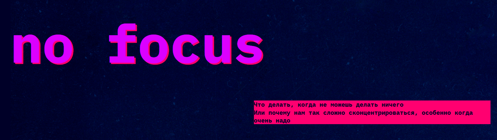
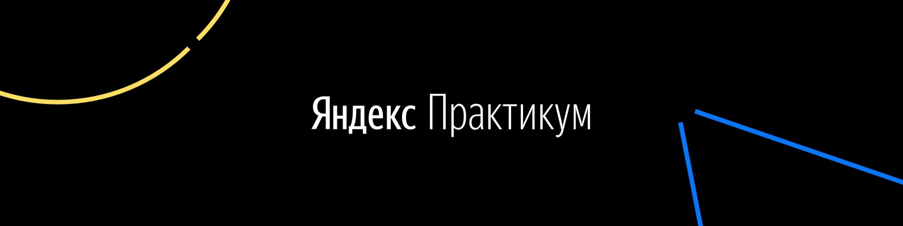

# О ПРОЕКТЕ: СЛОЖНО СОСРЕДОТОЧИТЬСЯ
https://github.com/viomida/slozhno-sosredotochitsya-fd

## Что требуется: 
-  Отображение в браузере должно соответствовать макетом и иметь корректные размеры и расположение элементов.
-  Сетка макета должна быть правильной и верстка не должна "ломаться" между брейкпоинтами.
-  Разметка кнопок переключения цветовой схемы должна быть корректной и переключение реализовано корректно.
-  Структура проекта должна быть единообразной, без пустых файлов и файлов, не относящихся к проекту.
-  Аккуратная разметка HTML, валидный HTML и корректное использование семантической разметки.
-  Корректное использование шрифтов, размеров, отступов и межстрочных расстояний.
-  Адаптивная верстка должна быть правильной и не содержать дублирующихся свойств.
- Использование хороших практик, таких как использование Prettier для автоформатирования кода и аккуратное форматирование CSS.
-  Соблюдение единообразия в именовании CSS классов и использовании современных синтаксисов.
-  Использование современных подходов и технологий, таких как методология БЭМ и применение CSS-переменных.
-  Соблюдение требований к стилям и использование хороших практик для улучшения проекта.

## О чем проект: 
_Сайт объясняет, почему сложно концентрироваться, и даёт советы._
**Суть:** Современные отвлечения (многозадачность, гаджеты, вредная еда) перегружают мозг и мешают фокусироваться. 
> [!TIP]
> Главный совет: Чтобы лучше концентрироваться, нужно давать мозгу отдых: гулять на природе, есть полезные продукты, читать бумажные книги и практиковать короткие медитации. Это краткое практичное руководство по борьбе с рассеянностью.

## Проект выполнен:
[Viomida](https://github.com/Viomida)

При лучшей поддержке от:
